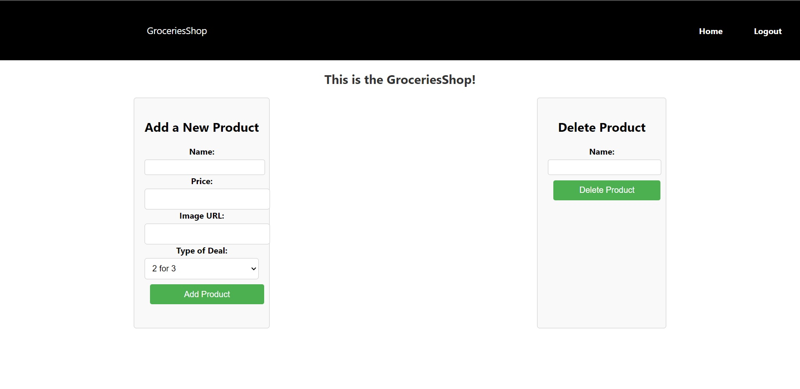
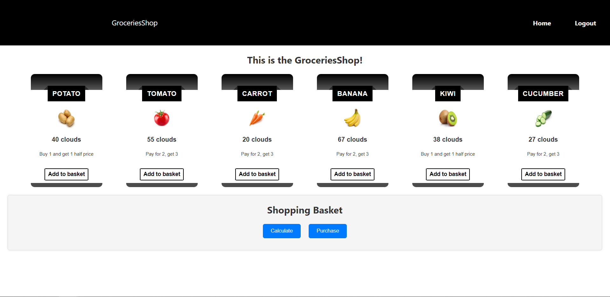

# Groceries Shop

This is a web app that allows an admin to publish his products and the deals and makes it easier for normal users to add the products to their basket and calculate the result based on the deals.

## Technologies
Backend: Spring boot
Frontend: React
Database: MongoDB

## Functionalities
Register and Login for users

Admin
- Admin is responsible for creating a product and deleting an existing product

Normal users
- Adding the presented products to their baskets
- Calculate the result from the basket
- Make a purchase

## Steps to run project locally
* Clone the repo
* Make sure you have an environment for running Spring Boot and React
* Run the server then run the client with `npm start`
* Your application is running on `localhost:3000`
* If you want to enter the admin page and add new products, the admin account is username: admin, password: admin
